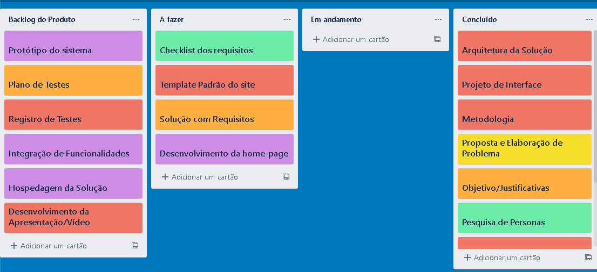

# Metodologia

Pré-requisitos: <a href="2-Especificação do Projeto.md"> Documentação de Especificação</a>

Descreva aqui a metodologia de trabalho do grupo para atacar o problema. Definições sobre os ambiente de trabalho utilizados pela  equipe para desenvolver o projeto. Abrange a relação de ambientes utilizados, a estrutura para gestão do código fonte, além da definição do processo e ferramenta através dos quais a equipe se organiza (Gestão de Times).

## Controle de Versão

A ferramenta de controle de versão adotada no projeto foi o
[Git](https://git-scm.com/), sendo que o [Github](https://github.com)
foi utilizado para hospedagem do repositório.

O projeto segue a seguinte convenção para o nome de branches:

- `main`: versão estável já testada do software
- `unstable`: versão já testada do software, porém instável
- `testing`: versão em testes do software
- `dev`: versão de desenvolvimento do software

Quanto à gerência de issues, o projeto adota a seguinte convenção para
etiquetas:

- `documentation`: melhorias ou acréscimos à documentação
- `bug`: uma funcionalidade encontra-se com problemas
- `enhancement`: uma funcionalidade precisa ser melhorada
- `feature`: uma nova funcionalidade precisa ser introduzida

## Gerenciamento de Projeto

Devido à natureza do projeto, a metodologia de projetos adotada pela equipe é a ágil, sendo o Scrum o processo utilizado.

### Divisão de Papéis

A equipe está organizada da seguinte maneira: 

**Scrum Master:** 
Daniel Diniz,

**Product Owner:** 
Lucas Veiga,  

**Equipe de Desenvolvimento:**
Hiago Lourenço,
Efraim Santos,
Guilherme Santos,

**Equipe de Design:** 
Ricardo Vieira. 

### Processo

O gerenciamento do projeto, isto é, a organização e distribuição das tarefas, está em desenvolvimento com uso do Trello e estruturado com as seguintes listas:

Backlog: Recebe as tarefas a serem trabalhadas, registra as atividades e representa o Product Backlog, isto é, as funcionalidades pretendidas que o produto tenha.  

A Fazer: É a relação das tarefas decididas no Sprint mais recente.  

Em Andamento: É a relação para onde são deslocadas as tarefas iniciadas.  

Feito: Tarefas concluídas para entrega ao usuário após testes e controle de qualidade, sem mais revisões e prontas para uso.

 
### Ferramentas

As ferramentas empregadas no projeto são:

|Ambiente |	Plataforma |	Link de Acesso|
|---------|------------|------------------|
|Repositório de código fonte| 	GitHub | <a href = "https://github.com/ICEI-PUC-Minas-PMV-ADS/pmv-ads-2023-1-e1-proj-web-t14-pmv-ads-2023-1-e1-proj-web-t14-g3-ffy/tree/main/src">Código Fonte</a>|
|Documentos do projeto| 	GitHub| <a href = "https://github.com/ICEI-PUC-Minas-PMV-ADS/pmv-ads-2023-1-e1-proj-web-t14-pmv-ads-2023-1-e1-proj-web-t14-g3-ffy/tree/main/docs">Documentação</a>|
|Projeto de Interface e  Wireframes| 	Figma | <a href ="https://www.figma.com/file/IIkq3mkmiyEbH04AJ62Eac/Fluxo-de-Usu%C3%A1rio?node-id=5%3A105&t=cKQeYOXJin4lQLT7-1">Wireframes</a>|
|Gerenciamento do Projeto 	|Trello 	| <a href ="https://trello.com/b/FTMjKZ8P/projeto-front-end">Gerenciamento</a>|
|Editor de Código| VisualStudio Code |<a href="https://code.visualstudio.com/">VisualStudio.com</a>|
|Comunicação | Teams | <a href="https://teams.microsoft.com/_#/school/conversations/Geral?threadId=19:amlkU-mmS8FrFIki66ijN9CgGTeE8mMAqrBLOJr_G4Y1@thread.tacv2&ctx=channel">Equipe do Teams</a>|

Para a hospedagem do código fonte e documentação utilizamos o GitHub. Por familiaridade dos desenvolvedores com a ferramenta figma, a mesma foi conscentida como melhor opção; o mesmo pode se dizer para a ferramenta Trello. Já o VisualStudioCode foi escolhido pela sua praticidade, acessibilidade e flexibilidade.
