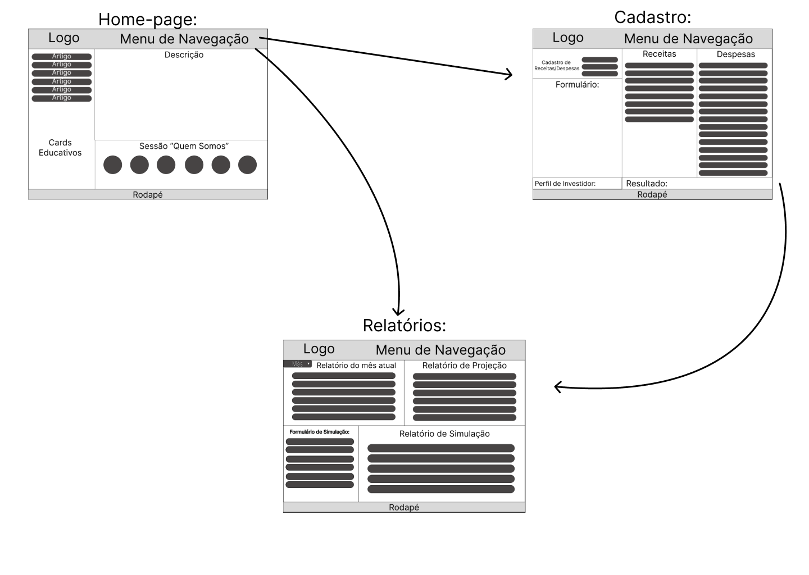
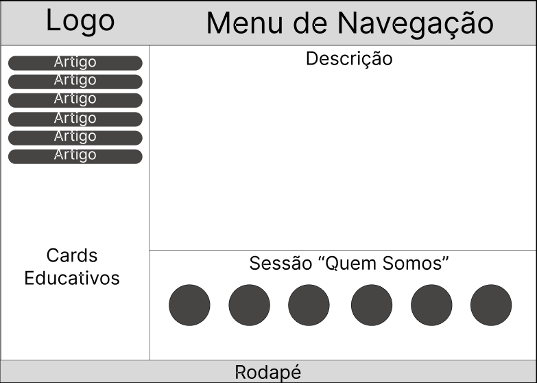
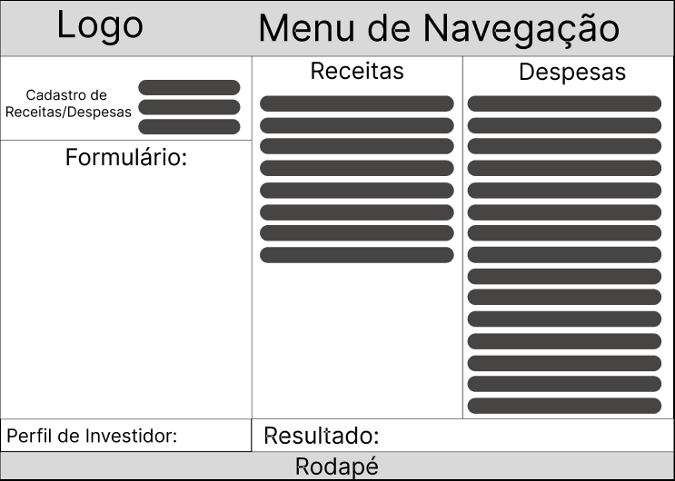
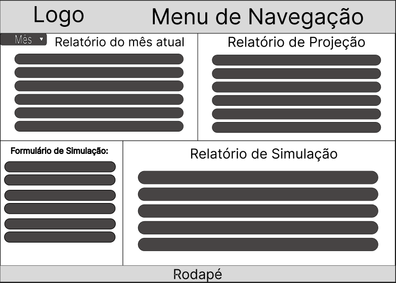

# Projeto de Interface

## User Flow

Ao entrar na home-page, o fluxo se dará pelo menu de navegação!
Já na tela de cadastros, ao enviar o formulário você será redirecionado a tela de formulários

## Wireframes

### Estrutura Padrão do Site

Representação de como é a organização padrão do site.

### Home-Page

No menu de navegação desta página, você terá a opção de seguir para qual página desejar!

### Cadastros

Nesta Página, você preencherá os formulários e ao clicar no botão: "Enviar Eormulário" será redirecionado automaticamente para a página: "Relatórios".

### Relatórios

Nesta Página seram exibidos os resultados de todos os cálculos feitos para ajudar na sua organização financeira.

