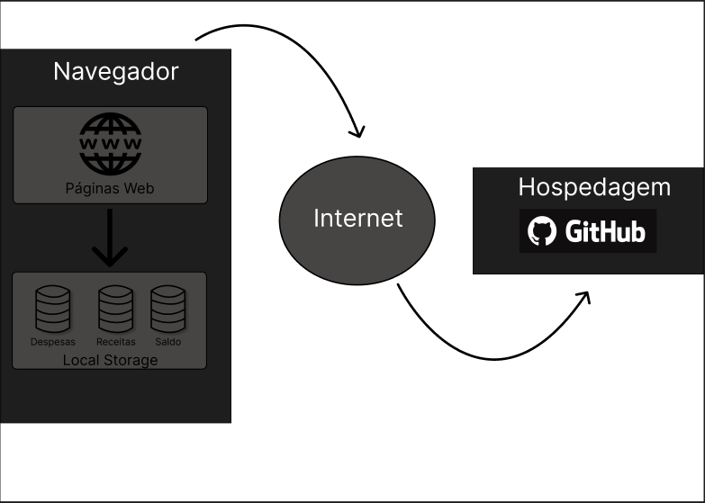

# Arquitetura da Solução

## Diagrama de componentes

Os componentes que fazem parte da solução são apresentados na Figura:

Arquitetura da Solução

A solução implementada conta com os seguintes módulos:
- **Navegador** - Interface básica do sistema  
  - **Páginas Web** - Conjunto de arquivos HTML, CSS, JavaScript e imagens que implementam as funcionalidades do sistema.
   - **Local Storage** - armazenamento mantido no Navegador, onde são implementados bancos de dados baseados em JSON. São eles: 
     - **Receitas** - Dados de todos os meses referentes as receitas do usuário. 
     - **Despesas** - Dados de todos os meses referentes as despesas do usuário. 
     - **Saldo** - Dados de todos os meses referentes ao saldo acumulado do usuário.
 - **Hospedagem** - local na Internet onde as páginas são mantidas e acessadas pelo navegador. 

A imagem a seguir ilustra o fluxo do usuário em nossa solução. Assim
que o usuário entra no site, ele é apresentado à tela inicial
(1.0 Home Page) com a apresentação da finalidade do site, sessão "Saiba mais" com links de artigos de Educação Financeira, sessão "Quem somos" apresentando os integrantes da equipe e o Menu principal na parte superior da tela.

A partir do Menu principal, o usuário poderá ser redirecionado para as telas de Cadastro ou Relatórios (a ser implementa). Ao clicar em algum link da sessão Saiba mais, o usuário será redicionado a um site externo com artigo educativo.

Na tela de Cadastro (2.0 Tela de Cadastro), o usuário poderá inserir suas informações de Receitas e Despesas (2.1 Despesa Adicionada) visualizando o resultado apurado, conhecer seu perfil de investidor através do formulário "Conheça seu perfil de investidor" (2.2 Formulário Ativo) e consultar/enviar dados para a tela Relatórios (3.0 Relatórios).

A tela Relatórios é uma solução à ser implementada na próxima etapa do projeto. Nesta tela, será apresentado o relatório do mês atual, o relatório de projeção para os próximos meses, um formulário para simulação de receitas/despesas e um relatório para a simulação. A tela ainda possuirá a opção de retornar à Home Page e à tela de Cadastro.
