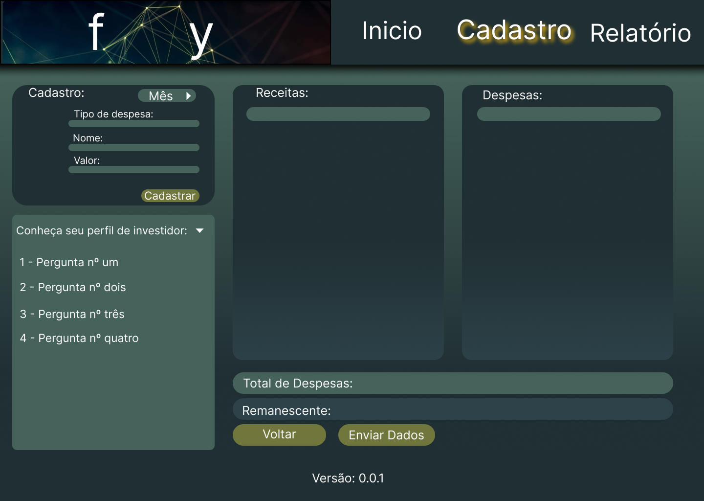

# Template padrão do site

O padrão de layout a ser utilizado pelo site tem correspondência ao projeto de Interface elaborado anteriormente conforme imagem abaixo:

O template criado é composto pelos seguintes layouts:  

- **Home Page**
- **Tela Cadastro**
- **Tela Relatórios** 

## Home Page

Tela com a apresentação da finalidade do site, sessão "Saiba mais" com links de artigos de Educação Financeira, sessão "Quem somos" apresentando os integrantes da equipe e o Menu principal na parte superior da tela.

## Tela Cadastro

Tela para inserção de Receitas/Despesas, visualizar Receitas/Despesas/Resultado e conhecer o Perfil de Investidor do Usuário.

## Tela Relatórios

Tela com a apresentação do relatório do mês atual, o relatório de projeção para os próximos meses, um formulário para simulação de receitas/despesas e um relatório para a simulação.

