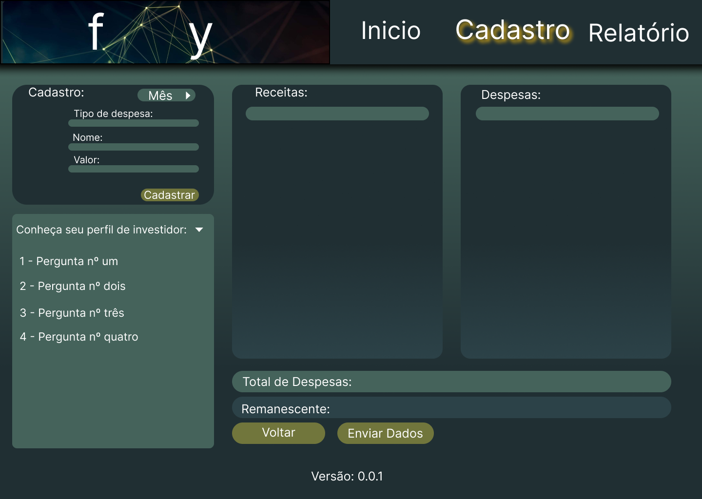

# Programação de Funcionalidades

Esta seção é apresentada a tela Cadastro desenvolvida para algumas funcionalidades do site.

##  Inserção de despesas e receitas (RF-01 e RF-02)

Na tela de Cadastro, o usuário poderá inserir suas informações de Receitas e Despesas visualizando o resultado apurado. O armazenamento é no Local Storage, mantido no Navegador, onde são implementados bancos de dados baseados em JSON.

*Requisitos atendidos*

- RF-01 O site deve permitir ao usuário inserir suas despesas.
- RF-02 O site deve permitir ao usuário inserir suas receitas.

*Artefatos da funcionalidade*

- app.js
- cadastro.html
- index.html
- reset.css
- style.css

*Instruções de acesso*

1. Faça o download do arquivo do projeto (ZIP) ou clone do projeto no GitHub; 
2. Descompacte o arquivo em uma pasta específica; 
3. Abra o Visual Studio Code e execute o Live Server; 